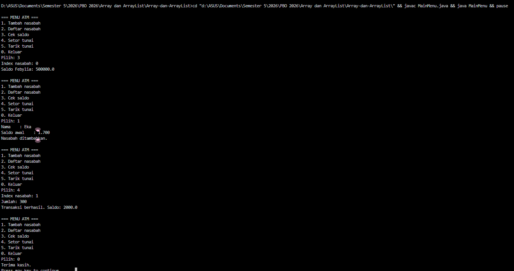

# Array-dan-ArrayList
# Tugas PBO 

## Nama : Baiq Febylia Eka Ningrum
## NIM  : F1D02410109

### Deskripsi Program

Program ini dibuat sebagai latihan Array of Objects pada mata kuliah Pemrograman Berorientasi Objek (PBO). Program mensimulasikan sistem perbankan sederhana berbasis Command Line Interface (CLI) menggunakan bahasa Java, dengan konsep Object-Oriented Programming (OOP) melalui tiga kelas utama: Account, Customer, dan Bank.

Sebuah Bank menyimpan banyak Customer dalam sebuah array, dan setiap Customer memiliki sebuah Account (rekening). Pada method main, program menambahkan nasabah, membuat akun, melakukan transaksi setor dan tarik, lalu menampilkan hasilnya.

### Struktur Kelas

#### Account.java
Menyimpan atribut balance (saldo). Memiliki method getBalance(), deposit(amt), dan withdraw(amt).

#### Customer.java
Menyimpan firstName, lastName, dan account. Memiliki method getFirstName(), getLastName(), setAccount(), dan getAccount().

#### Bank.java
Menyimpan array customers (maksimal 10 nasabah) dan numberOfCustomers. Memiliki method addCustomer(), getNumOfCustomers(), dan getCustomer(index).

#### MainMenu.java
Versi alternatif main yang dipisah per fitur.

### Fitur Program

1. Tambah nasabah: addCustomer() membuat objek Customer baru dan memasukkannya ke array (maksimal 10 nasabah).
2. Beri akun: setAccount() menghubungkan Account dengan saldo awal ke nasabah.
3. Setor tunai (deposit): menambah saldo. Gagal jika jumlah 0 atau negatif.
4. Tarik tunai (withdraw): mengurangi saldo. Gagal jika jumlah tidak valid atau melebihi saldo.
5. Validasi index: getCustomer(index) mengembalikan null jika index tidak valid.
6. Kapasitas array: jika bank penuh, program menampilkan pesan bahwa kapasitas sudah penuh.

## Output

## Informasi Tambahan

Program tidak menggunakan library tambahan (hanya fitur bawaan Java/JDK).